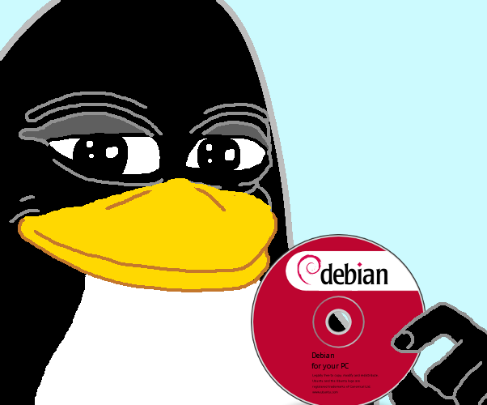
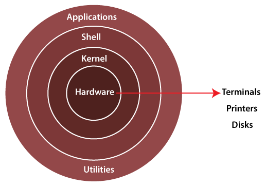

Chào mừng bạn đến với bài viết đầu tiên, mở đầu tutorial của chúng mình.
Mình là Tux, người đồng hành cùng bạn trong cuộc hành trình này.
Hãy cùng bắt đầu với một chút flashback về lịch sử đằng sau sự hình thành linux.

## 1. Tổng quan về linux

Năm 1969, Ken Thompson và Dennis Ritchie tại viện nghiên cứu Bell (đại học MIT) đã phát triển hệ điều hành UNIX.
Ban đầu, UNIX được viết bằng assembly.
Sau đó nó đã được viết lại bằng C để ổn định và di động hơn.

Suốt khoảng thời gian đó, rất nhiều hệ điều hành như BSD, MINIX, ... được phát triển dựa trên hệ thống UNIX.
Tuy nhiên, chúng đều không quá thành công.
Điểm chung của chúng là đều thiếu một nhân (kernel) thống nhất.

**Nhân** (kernel) là thành phần quan trọng nhất của một hệ điều hành.
Nhân cho phép phần cứng "nói chuyện" được với phần mềm.
Ngoài ra, nó còn có thể làm được ti tỉ thứ khác, nhưng chúng ta sẽ tìm hiểu sau.
Còn giờ, bạn chỉ cần biết nhân điều khiển hầu như mọi thứ trong hệ thống của bạn.

Vào năm 1991, một thanh niên trẻ tên Linus Torvalds đã bắt đầu phát triển thứ mà chúng ta gọi là nhân linux.
Và rồi... boom!

Linux ra đời!

Linux là hệ điều hành mã nguồn mở (open-source) ra đời từ khoảng 30 năm trở lại đây, được phát triển dựa trên hệ điều hành UNIX và viết bằng ngôn ngữ lập trình C.

> _Fun fact_: Linus Torvalds đã muốn gọi phát minh của mình là Freax, một từ ghép giữa "free", "freak", và "x" (như là một ám chỉ đến Unix).
> Ông đã từng xem xét cái tên "Linux," nhưng ban đầu bác bỏ nó do quá tự cao tự đại.
> Sau đó thì một trong những admin của máy chủ linux của trường tự đặt tên dự án là "Linux" mà không hỏi ý kiến Torvalds.
> Sau cùng, ông cũng đồng ý với cái tên "Linux".

Linux được xuất bản dưới giấy phép công cộng GNU, giúp hạn chế hoạt động về thương mại. Ông từng tuyên bố, "Phát hành Linux theo GNU chắc chắn là điều tốt nhất tôi từng làm." Nếu không thì chúng ta đã không có một hệ điều hành tuyệt vời với đông đảo lập trình viên ưa thích như hôm nay.

Cấu trúc hệ điều hành Linux tóm gọn lại chỉ gồm 3 phần chính:

- **Kernel**: hay được gọi là phần nhân, vì đây là phần quan trọng nhất trong máy tính bởi chứa đựng các module hay các package để quản lý, giao tiếp giữa phần cứng máy tính và ứng dụng.
- **Shell**: là phần có chức năng thực thi các lệnh (command) từ người dùng hoặc từ các ứng dụng yêu cầu, chuyển đến cho kernel xử lý. Nói nôm na, shell chính là cầu nối để kernel và ứng dụng nói chuyện với nhau.
- **Application**: là phần quen thuộc với chúng ta nhất, phần để người dùng cài đặt và chạy ứng dụng để người dùng có thể phục vụ cho nhu cầu của mình.

**Ghi nhớ**: Linux là hệ điều hành open-source, đa số các thao tác thực hiện trên linux sẽ thông qua các câu lệnh gọn gàng và nhanh trên terminal.
