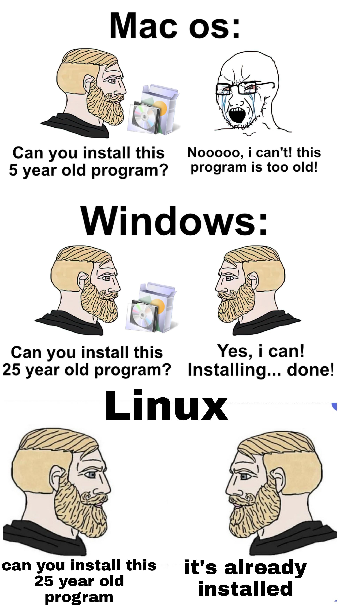
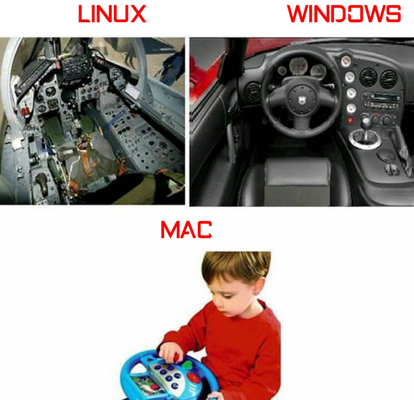
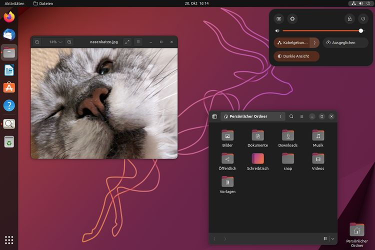
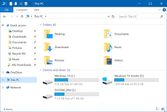
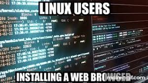
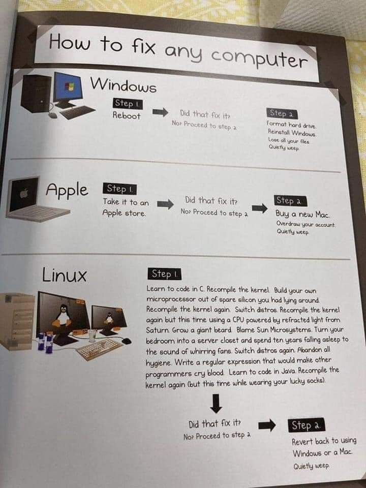

Chúng ta hãy cùng so sánh Linux với hai hệ điều hành phổ biến là Windows và MacOS.
:::info 
:bulbs:
**Dit me VNPT**
:::
https://youtu.be/o14-gCNRwR8

### Cài đặt

Để cài Windows, chỉ cần một USB Boot có chứa Windows là có thể cài được. Windows chạy được với hầu hết các loại phần cứng, nhưng yêu cầu tối thiểu 1 GHz CPU, RAM từ 1-2 Gb và ổ cứng 15 Gb. Sau đó, quy trình cài đặt chỉ cần "bấm" và "chọn".

Khác với Windows, macOS được cài đặt sẵn trong các máy macbook hoặc iMac. Khi máy về, chỉ cần tùy chỉnh một số chức năng cho phù hợp là được.

Hiện tại, cài đặt Ubuntu đã được tinh gọn, thêm giao diện người dùng (UI). Cũng giống Windows, để cài Ubuntu chỉ cần một USB Boot có chứa Ubuntu theo phiên bản đã chọn. Nhưng so với Windows thì Ubuntu có yêu cầu phần cứng thấp hơn nhiều. Các máy từ đời "Hán" với chip Pentium 10 năm tuổi cũng có thể cài được và sử dụng trơn tru.

Nhưng nếu bạn cài đặt một phiên bản của Linux: Arch thì đó là một câu chuyện khác. Bạn sẽ phải cài đặt lại hết từ đầu những thứ cần có của một hệ điều hành. Từ việc chia phân vùng, kết nối internet, thiết lập đồng hồ, cài đặt packages liên quan, ... tất cả thực hiện trên giao diện dòng lệnh terminal (CLI).

Nhưng "thương cho roi cho vọt", một khi bạn cài được Arch, bạn sẽ học được vô số kiến thức bổ ích về Linux, thứ sẽ giúp bạn rất nhiều sau này. Adu bbi a anh yeu em nhieu lam.

### Độ tương thích phần mềm

Windows là hệ điều hành thông dụng nhất, và nhờ đó hầu hết phần mềm tương thích với nó. Tương tự, macOS cũng có một hệ sinh thái phần mềm riêng. Ví dụ đối với editor, thay vì dùng Adobe Premier (tương thích với Windows và macOS), họ có thể dùng DaVinci Resolve, phần mềm edit video độc quyền của macOS.

Tuy nhiên đối với Linux, một vài phần mềm ở Windows không có phiên bản cho Linux như Zalo, Adobe (Photoshop, Illustrator, Premier, ...). Bạn vẫn có thể sử dụng chúng thông qua [Wine](https://www.winehq.org/), nhưng khó để nói chúng chạy mượt mà như trên Windows.

Ngoài ra hầu hết các game trên Windows sử dụng driver của riêng họ là DirectX, vì vậy, nếu bạn dành phần lớn thời gian chơi game thì tốt nhất là dùng Windows.

Tuy nhiên, lợi thế của Linux là các phần mềm cũ từ nhiều năm trước cũng có thể cài đặt được. Ví dụ bạn cần cài đặt phiên bản chục năm trước của một phần mềm để học tập.

### Độ khó sử dụng

Windows và macOS có giao diện rất thân thiện với người dùng. Tuy nhiên, chúng không phải môi trường tốt cho việc coding. MacOS được phát triển từ nhân Linux nên có một số câu lệnh tương tự Linux, nhưng thực tế, không ai chạy và quản lý server bằng macOS cả.

Hiện tại phiên bản Ubuntu 22.10 đã được phát triển rất thân thiện với người dùng, bạn không phải mất quá nhiều thời gian để làm quen với nó.

### Bảo mật và ổn định

Không có gì phải bàn cãi, Linux là hệ điều hành bảo mật và ổn định nhất. Thực tế với mã nguồn được công khai không khiến nó trở nên nguy hiểm như bạn vẫn nghĩ, ngược lại đó là một lợi thế. Mã nguồn mở khiến lỗi được phát hiện và chữa nhanh hơn.

Mặc khác, Windows được coi là hệ điều hành dễ bị lây lan virus nhất. Với lượng người dùng lớn, Windows trở thành mục tiêu cho các phần mềm malware và virus.

### Quản lý files

Windows sử dụng "drives", gọi dân dã là ổ đĩa/phân vùng. Thường là ổ đĩa C hoặc D sẽ chứa files liên quan đến hệ thống. Bạn cũng có thể chia thêm ổ đĩa từ C hoặc D để lưu trữ file cá nhân. Ngoài ra có các ổ đĩa ngoài như CD, USB.

Mặt khác, macOS và Linux có hệ thống quản lý files khá tương đồng vì cùng đến từ UNIX. Chúng không có "drives" như Windows, thay vào đó mọi thứ trong máy tính được coi như 1 file (kể cả ổ cứng ngoài), và tất cả files được tổ chức dưới dạng thư mục, phân chia theo cây với cùng một gốc.

### Shells

Một trong những thứ mà Tux thích nhất khi dùng Linux là terminal. Cả Linux và macOS đều đặt `bash` là shell mặc định. Trong khi đó Windows có hệ thống shell riêng là `powershell`, với cách dùng và syntax khác biệt.

Là lập trình viên, sử dụng shell để tương tác với kernel là một trong những điều bắt buộc. Lý do vì hầu hết các server hiện nay đều là Linux, kể cả khi bạn muốn thuê một VPS, hay Cloud Compute Engine. Terminal thực sự giúp cuộc sống lập trình viên dễ dàng hơn, hay vì luôn dùng chuột để điều khiển máy tính.

### Cộng đồng hỗ trợ

Mặc dù lượng người dùng không nhiều bằng hai hệ điều hành kia, cộng đồng người dùng Linux là những người yêu phần mềm và đam mê công nghệ. Họ thường trao đổi, chia sẻ, hỗ trợ kiến thức với nhau.

MacOS cũng sở hữu một lượng fan, phần lớn về sáng tạo (thiết kế đồ họa, animation, video, ...) và về cách sử dụng những thứ được Apple làm sẵn.

Và cuối cùng, Windows được sử dụng đại trà bởi người dùng phổ thông.

