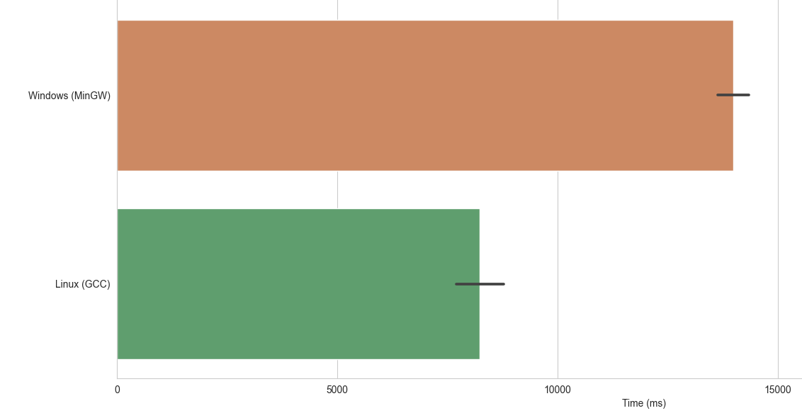

### 1. Thiên đường mã nguồn mở

Khi bạn quá mệt với các yêu cầu trả tiền bản quyền các ứng dụng, hay thậm chí là bản quyền cho chính hệ điều hành của bạn?
Linux là dành cho bạn, nơi mà mọi người chỉ cần clone về mọi thứ một cách miễn phí.
Ngoài ra nó còn có điểm cộng nữa là bạn có thể xem được bên trong source của chúng có những gì, thông qua đó, ta có thể dễ dàng tùy biến chúng.

### 2. Thích hợp cho "dân code" (developers)

Tốc độ compile, debug bằng các ngôn ngữ lập trình trên Linux nhanh hơn nhiều so với các hệ điều hành khác.
Thích hợp hoàn hảo dành cho dân code chính hiệu.
Ảnh dưới so sánh tốc độ compile một file C++ 1000 dòng code, sample size = 1000 lần.

### 3. Bảo mật an toàn

Điều này dễ hiểu vì khi cài đặt hay thực thi bất cứ thứ gì trong Linux bạn cũng sẽ cần sự cấp phép “superuser", và cũng nhờ cơ chế phân quyền tài khoản, cách linux tổ chức quản lí file trên hệ thống,...
Như chúng ta đã biết, các hệ điều hành khác sẽ dễ bị tấn công bởi các kiểu tấn công khác nhau (hoặc bị khai thác các lỗ hổng zero-day).
Tuy không phải là bất khả xâm phạm nhưng theo những thống kê cho thấy: số lượng các cuộc tấn công hay mã độc chủ yếu xảy ra với các server chạy Windows.
Linux không phải là tượng đài bất khả xâm phạm nhưng chắc chắn nó an toàn hơn windows mặc cho các công nghệ tường lửa trên windows ngày một phát triển (thật ra không ai rảnh mà viết malware hay virus cho linux cả).

### 4. Cấu hình siêu nhẹ, hiệu suất cao

Cấu hình mà Linux yêu cầu là rất thấp, thấp hơn rất nhiều so với các OS khác như macOS hay Windows.
Thực tế ta thấy nhiều người có máy tính chỉ với 1GB RAM chạy linux trên chip Pentium vẫn ổn định mượt mà, với cấu hình tương tự chúng ta sẽ gặp nhiều khó khăn khi thực hiện các thao tác thông thường trên Windows.
Vì thế, không phải lo về việc Linux chiếm bao nhiêu dung lượng hay đòi hỏi cấu hình ra sao, cho dù máy tính bạn chỉ còn trống vài chục GB và có cấu hình từ đời “tống", thì nó vẫn chạy rất tốt Linux.

Yêu cầu tối thiểu của Linux (Distro: Arch):

- RAM: 512 MB (recommended 2 GB).
- Trống ít nhất 1GB ổ đĩa (recommended 20 GB).
- Có kết nối Internet

### 5. Khả năng tùy biến cao

Linux mang lại cho người dùng khả năng "thiên biến vạn hóa" trên chính hệ điều hành của mình, từ custom giao diện (hay còn gọi là "RICE"), config terminal, config hệ thống, v.v…
Nhưng sẽ còn tùy thuộc vào thẩm mỹ của người mình (Tux sẽ có thêm chi tiết về custom giao diện Linux chi tiết cho các bạn sau).

### 6. Cộng đồng hỗ trợ đông đảo

Khi sử dụng Linux, nếu bạn đang có thắc mắc hay chiếc máy tính chạy Linux của bạn không may gặp phải gì đó.
Thay vì phải đem ra tiệm và bị ép cài win lại như máy Win (xong bị thu phí vài trăm ngàn), hoặc bị tư vấn và phải mua hẳn một cái máy mới như macbook, thì ta chỉ cần search google hay tra stackoverflow để biết được mọi giải pháp cho mọi vấn đề fix mọi thứ, các trang cộng đồng linux như ITS-FOSS, hoặc như ở đây, các bạn có UBUNCHUU, mọi người luôn luôn welcome và cởi mở để giúp đỡ nhau.
Chỉ cần với tinh thần ham học hỏi, không việc gì là khó với chúng mình cả.
